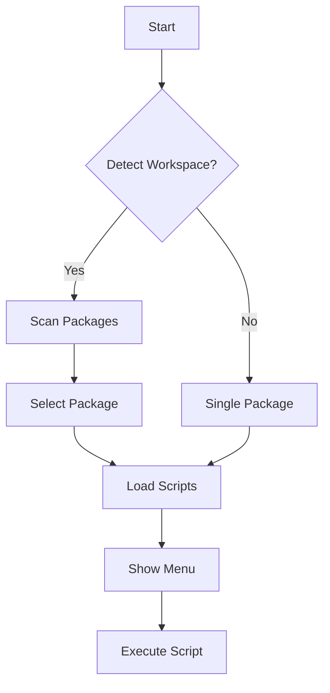

# Smart-Run CLI Package Plan

This document outlines the refactored architecture for the `smart-run` CLI package within the monorepo structure.

---

## Package Overview

**Name:** `smart-run`  
**Type:** CLI Application  
**Dependencies:** `@smart-run/core`, `@smart-run/formats`  
**Purpose:** Command-line interface for interactive npm script execution with monorepo support

---

## Architecture

```
packages/smart-run/
├── src/
│   ├── cli/
│   │   ├── index.ts              # CLI entry point
│   │   └── commands/
│   │       ├── run.ts            # Default interactive command
│   │       ├── list.ts           # List scripts
│   │       ├── analyze.ts        # AI analysis
│   │       ├── migrate.ts        # Config migration
│   │       ├── lint.ts           # Config linting
│   │       ├── sync.ts           # Config sync
│   │       └── hooks.ts          # Git hooks
│   ├── application/
│   │   ├── services/
│   │   │   ├── ScriptExecutor.ts
│   │   │   ├── ConfigManager.ts
│   │   │   └── MonorepoScanner.ts
│   │   └── presenters/
│   │       ├── InteractiveMenu.ts
│   │       └── ScriptFormatter.ts
│   ├── infrastructure/
│   │   ├── FileSystemConfigRepository.ts
│   │   ├── NodeProcessExecutor.ts
│   │   └── OpenAIAnalyzer.ts
│   └── utils/
│       ├── package-manager.ts
│       └── shell-setup.ts
├── bin/
│   └── smart-run.js
├── package.json
├── tsconfig.json
└── README.md
```

---

## Core Features

### 1. Interactive Script Runner
```typescript
interface InteractiveRunnerOptions {
  cwd?: string;
  filter?: string;
  workspace?: string;
  package?: string;
}

class InteractiveRunner {
  constructor(
    private scriptRepo: IScriptRepository,
    private executor: IProcessExecutor,
    private presenter: IMenuPresenter
  ) {}

  async run(options: InteractiveRunnerOptions): Promise<void>;
}
```

### 2. Monorepo Support
```typescript
class MonorepoScanner {
  async detectWorkspace(cwd: string): Promise<Workspace | null>;
  async getPackages(workspace: Workspace): Promise<Package[]>;
  async aggregateScripts(packages: Package[]): Promise<ScriptGroup[]>;
}
```

### 3. Configuration Management
```typescript
class ConfigManager {
  constructor(
    private formatRegistry: FormatRegistry,
    private configRepo: IConfigRepository
  ) {}

  async detect(): Promise<IScriptFormat>;
  async load(): Promise<ScriptConfig>;
  async save(config: ScriptConfig): Promise<void>;
  async sync(): Promise<void>;
}
```

---

## Command Structure

### Default Command (Interactive)
```bash
smart-run [options]
  -f, --filter <pattern>    Filter scripts by pattern
  -w, --workspace <name>    Select workspace (monorepo)
  -p, --package <name>      Select package (monorepo)
```

### Subcommands
```bash
smart-run list [options]      # List all scripts
smart-run analyze [options]   # AI analysis of scripts
smart-run migrate [options]   # Migrate from other formats
smart-run lint [options]      # Lint configuration
smart-run sync [options]      # Sync config with package.json
smart-run hooks [options]     # Manage git hooks
```

---

## Monorepo Detection Flow



---

## Configuration Priority

1. Command-line arguments
2. Environment variables
3. Local config file (`.smartrunrc`)
4. Package-specific config
5. Workspace-level config
6. Global config

---

## Integration Points

### With @smart-run/core
- Import domain entities
- Use format interfaces
- Leverage business logic

### With @smart-run/formats
- Format detection
- Config parsing/serialization
- Migration utilities

---

## Migration from Current Code

### Phase 1: Structure
1. Move existing code to packages/smart-run
2. Extract domain logic to @smart-run/core
3. Extract formats to @smart-run/formats

### Phase 2: Refactor
1. Implement clean architecture layers
2. Add dependency injection
3. Create proper abstractions

### Phase 3: Features
1. Add monorepo support
2. Implement config sync
3. Add new format support

---

## Testing Strategy

### Unit Tests
```typescript
// Test individual components
describe('MonorepoScanner', () => {
  it('detects pnpm workspace');
  it('finds all packages');
  it('handles nested workspaces');
});
```

### Integration Tests
```typescript
// Test command flows
describe('smart-run CLI', () => {
  it('runs script in monorepo');
  it('migrates config formats');
  it('syncs with package.json');
});
```

### E2E Tests
```bash
# Test actual CLI execution
smart-run --help
smart-run list --json
smart-run --filter test
```

---

## Performance Considerations

1. **Lazy Loading**
   - Dynamic imports for commands
   - Load formats on-demand
   - Defer AI client initialization

2. **Caching**
   - Cache workspace detection
   - Cache package discovery
   - Cache script parsing

3. **Parallelization**
   - Parallel package scanning
   - Concurrent format detection
   - Batch AI requests

---

*End of package plan*
